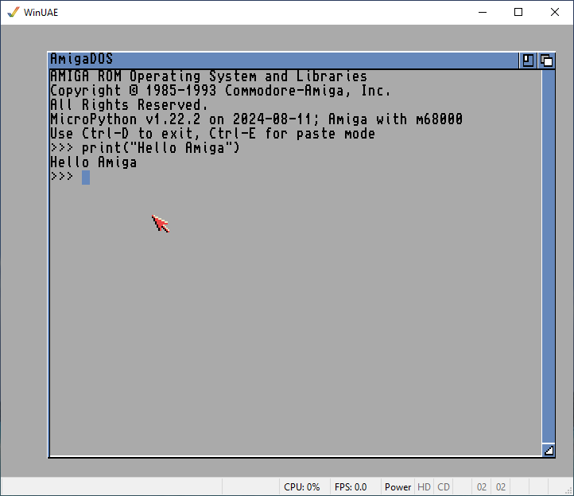

# Amiga Micropython

Amiga Micropython is a fork of the MicroPython project for the Amiga classic computers (running Amiga OS 3.1). Please refer to the [MicroPython project github](https://github.com/micropython/micropython) for all details.

## Amiga specific features

- This version should be considered as preliminary. Most of the tests are passing, but some are still failing.
- Networking (tcp) is available but not SSL. Thus, bsdsocket.library is required.
- Passing tests (some have been sightly modified for the Amiga) can be found in the tests directory: basics, cmdline, cpydiff, extmod, feature_check, float, frozen, import, internal_bench, io, micropython, misc, net_hosted, net_inet (without SSL), perf_bench, stress and unicode.
- Neither viper nor native modes are supported (most of the viper tests are passing but some are crashing!).

## How-to-use

- Copy `out/amp` somewhere on your Amiga disk.
- In a CLI/Shell with at least 64 KB of stack, launch `amp` and you will start the Python shell, REPL (Read-Eval-Print Loop), waiting then for your commands (see picture above). 4 MB of RAM are recommended although `amp` may work with less.
- You can also type `amp` followed by a Python script (you'll find plenty in the tests directory).
- You'll find on youtube a [video showing the previous steps](https://www.youtube.com/watch?v=C3QLlymHQ3M).

## How-to-compile

The compilation has so far only been tested under Windows 10 and Windows 11.
It is required that the following commands are present in the search path (install for example [MSYS2](https://www.msys2.org/)): mkdir.exe, cp.exe, sed.exe, rm.exe, touch.exe and cat.exe.
Python3 is also required, as python (and not python3) in the search path.
The steps for the compilation are then :

0. Install [Visual Studio Code](https://code.visualstudio.com/)
1. In Visual Studio Code, install the extension [Amiga C/C++ Compile, Debug & Profile (fork with libs support)](https://marketplace.visualstudio.com/items?itemName=JOB.amiga-debug-job) v1.7.7 or higher
2. Download [Amiga Micropython branch port-amiga](https://github.com/jyoberle/micropython-amiga) as a zip file and unzip it in a local directory
3. Open `.vscode/launch.json` and make `"kickstart"` point to your *Kickstart 3.1* ROM and `"workbench"` to your *Workbench 3.1* floppy (.adf)
4. In Visual Studio Code, open the local directory through the menu File->Open Folder...
5. Hit <kbd>F5</kbd> to build and run the compiled program (you should see the REPL of the above screenshot).
